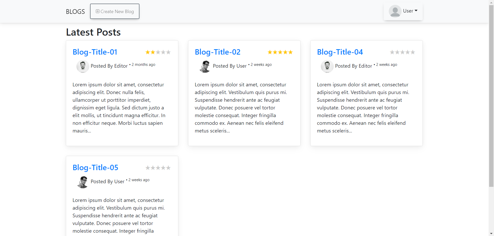
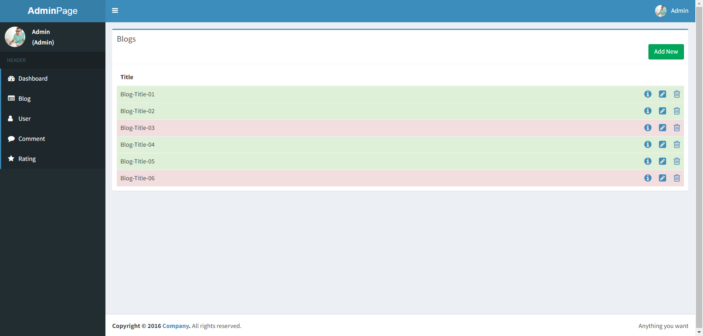

# Laravel 8 ile yapılmış Ziyaretci Blog
## Açıklama
Ziyaretcilerin ve üyelerin bloglar oluşturup birbirlerinin bloglarını puanlayıp yorum yapmasını sağlayan, Laravel web uygulama iskeleti ile oluşturulmuş bir websitesidir
## Frontend

## Backend

## Yükleme Adımları
- git clone [https://github.com/numanvrl/laravel-ziyaretci-blog.git]
- cd laravel-ziyaretci-blog
- composer install or composer update
- cp .env.example .env
- Set up .env file
- php artisan key:generate
- php artisan storage:link
- php artisan serve
- http://127.0.0.1:8000/
